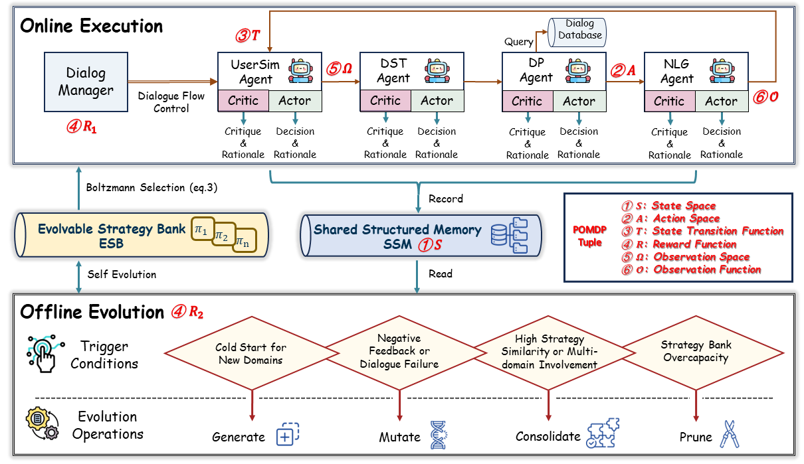

# DarwinTOD: LLM Driven Lifelong Self Evolution for Task Oriented Dialog Systems

Official PyTorch implementation for **"DarwinTOD: LLM Driven Lifelong Self Evolution for Task Oriented Dialog Systems"**. This repository contains the complete end-to-end code to reproduce our results, including the online generation of all results described in our work.



## Table of Contents
- [✨ Features](#-features)
- [⚙️ Installation & Setup](#%EF%B8%8F-installation--setup)
- [📦 Dataset Preparation](#-dataset-preparation)
- [🔧 Configuration Setup](#-configuration-setup)
- [🚀 Running Instructions](#-running-instructions)
- [📂 Directory Structure](#-directory-structure)
- [🤝 Contributing](#-contributing)

## ✨ Features

DarwinTOD introduces a groundbreaking lifelong self-evolution framework for task-oriented dialog systems, integrating evolutionary computation with modern LLM-driven strategy optimization. Key innovations include:

### 🧬 Lifelong Self-Evolution Paradigm
- Formulates dialog strategy optimization as a population-based evolutionary process with continuous adaptation
- Operates through a closed-loop dual architecture for autonomous improvement without human intervention
- Maintains an **Evolvable Strategy Bank (ESB)** that undergoes parallel competition, fitness-based selection, and elimination

### 🔄 Dual-Loop Architecture
- **Online Execution Loop**: Multi-agent dialog execution with peer critique, leveraging POMDP evaluation
- **Offline Evolution Loop**: Structured evolutionary operations (Generate/Mutate/Consolidate/Prune) to refine strategies
- Boltzmann selection for balanced exploration-exploitation trade-off

### 🌐 Multi-Domain Adaptability
- Zero-shot generalization to new domains through evolutionary operators
- Effective in both few-shot and data-scarcity scenarios
- Handles complex multi-turn dialogues across diverse domains

### 🛡️ Robust Design
- Modular pipeline architecture preventing cascaded error propagation
- Structured peer critique mechanism for error containment
- Built-in safety and alignment through evolutionary pressure

## ⚙️ Installation & Setup

### Python Version Requirement
Python 3.10 or higher is required for this project.

### Installation Steps
```shell
# Create virtual environment
python -m venv darwintod_env
source darwintod_env/bin/activate

# Install dependencies
pip install -r requirements.txt

# Verify installation
python -c "import torch; print(f'PyTorch version: {torch.__version__}')"
```

## 📦 Dataset Preparation

DarwinTOD supports two established TOD benchmarks: MultiWOZ and Schema-Guided Dialogue (SGD). Follow these steps to prepare the datasets:

### MultiWOZ Dataset
1. **Download Dataset**: 
   ```shell
   cd data/multiwoz
   wget https://github.com/budzianowski/multiwoz/blob/master/data/MultiWOZ_2.1.zip
   unzip MultiWOZ_2.1.zip
   ```

2. **Preprocess Data**: 
   ```shell
   python preprocess.py
   ```

3. **Handle Exception Data**: 
   ```shell
   python process_description.py
   ```

### SGD Dataset
1. **Download Dataset**: 
   ```shell
   cd data/sgd
   wget https://github.com/google-research-datasets/dstc8-schema-guided-dialogue/archive/refs/heads/master.zip -O dstc8-schema-guided-dialogue-master.zip
   unzip dstc8-schema-guided-dialogue-master.zip
   ```

2. **Preprocess Data**: 
   ```shell
   python preprocess.py
   ```

3. **Extract User Goals**: 
   ```shell
   python generate_goals.py
   ```

## 🔧 Configuration Setup

DarwinTOD uses YAML configuration files for initial parameter setup. The default configuration is located at `config/default_config.yaml`. Key configuration sections include:

### General Settings
- `project_name`: Project identifier
- `version`: Current version
- `debug`: Debug mode toggle
- `log_level`: Logging verbosity (INFO, DEBUG, WARNING, ERROR)

### Data Settings
- `default_dataset`: Choose between "multiwoz" and "sgd"
- `data_dir`: Root data directory
- `max_dialogue_turns`: Maximum number of turns per dialogue
- Dataset-specific settings for MultiWOZ and SGD domains

### Agent Settings
- Model configurations for E2E, DST, DP, NLG, and User Simulator agents
- Temperature parameters for generation diversity
- API settings for various LLM backends (OpenAI, Qwen, DeepSeek, vLLM, Ollama)

### Memory Settings
- `ssm_dir`: Directory for Shared Structured Memory
- `esb_datafile`: Path to Evolvable Strategy Bank storage

### API Settings
- Configure API keys and endpoints for LLM services
- Support for both cloud-based and local LLM deployments

### To Modify Configuration
1. Copy the default configuration file:
   ```shell
   cp config/default_config.yaml config/custom_config.yaml
   ```
2. Edit `config/custom_config.yaml` to adjust parameters
3. Pass the custom configuration file to the run scripts using the `--config` argument

## 🚀 Running Instructions

DarwinTOD provides two main run scripts for different architectures:

### Pipeline TOD Architecture (`run.py`)

```shell
python src/run.py <dataset> <num_dialogues> [options]
```

#### Command-Line Parameters
- **Required Arguments**:
  - `dataset`: Dataset name (`multiwoz` or `sgd`)
  - `num_dialogues`: Number of dialogues to run

- **Optional Arguments**:
  - `--config`: Path to configuration file (default: `config/default_config.yaml`)
  - `--output_dir`: Output directory for results (default: `experiments/results`)
  - `--log_level`: Logging level (default: `INFO`)

#### Example Usage
```shell
# Run 100 dialogues on MultiWOZ dataset
python src/run.py multiwoz 100

# Run 50 dialogues on SGD dataset with custom configuration
python src/run.py sgd 50 --config config/custom_config.yaml --output_dir experiments/sgd_results
```

### End-to-End TOD Architecture (`run_e2e.py`)

```shell
python src/run_e2e.py <dataset> <num_dialogues> [options]
```

#### Command-Line Parameters
- **Required Arguments**:
  - `dataset`: Dataset name (`multiwoz` or `sgd`)
  - `num_dialogues`: Number of dialogues to run

- **Optional Arguments**:
  - `--config`: Path to configuration file (default: `config/default_config.yaml`)
  - `--output_dir`: Output directory for results (default: `experiments/results`)
  - `--log_level`: Logging level (default: `INFO`)

#### Example Usage
```shell
# Run 100 end-to-end dialogues on MultiWOZ dataset
python src/run_e2e.py multiwoz 100

# Run 50 end-to-end dialogues on SGD dataset with custom configuration
python src/run_e2e.py sgd 50 --config config/custom_config.yaml --output_dir experiments/sgd_e2e_results
```

## 📂 Directory Structure

```
DarwinTOD/
├── config/                      # Configuration files
│   └── default_config.yaml      # Default parameters
├── convlab/                     # Conversational AI lab utilities
│   └── util/                    # Unified dataset utilities
├── data/                        # Dataset storage
│   ├── multiwoz/                # MultiWOZ dataset
│   │   ├── preprocess.py        # MultiWOZ preprocessing script
│   │   └── process_description.py  # Exception handling script
│   └── sgd/                     # Schema-Guided Dialogue dataset
│       ├── preprocess.py        # SGD preprocessing script
│       └── generate_goals.py    # SGD user goal extraction
├── src/                         # Main source code
│   ├── agents/                  # LLM agent implementations
│   ├── core/                    # Core framework components
│   ├── esb/                     # Evolvable Strategy Bank modules
│   ├── models/                  # Model architectures
│   ├── utils/                   # Utility functions
│   ├── post_analysis.py         # Post-experiment analysis
│   ├── run.py                   # Pipeline TOD run script
│   └── run_e2e.py               # End-to-end TOD run script
├── requirements.txt             # Python dependencies
├── LICENSE                      # License information
└── README.md                    # This file
```

## 🤝 Contributing

We welcome contributions to enhance this project. If you're interested in contributing, please follow these steps:

1. **Fork the repository**
2. **Create a new branch** for your feature or bug fix:
   ```shell
   git checkout -b feature/AmazingFeature
   ```
3. **Commit your changes** with clear messages:
   ```shell
   git commit -m 'Add some AmazingFeature'
   ```
4. **Push to your forked repository**:
   ```shell
   git push origin feature/AmazingFeature
   ```
5. **Open a Pull Request** detailing your changes and motivation

## 📊 Evaluation Metrics

DarwinTOD uses standard TOD evaluation metrics:
- **Inform**: Measures accuracy of provided entity information
- **Success**: Evaluates whether all user constraints are satisfied
- **BLEU**: Assesses response fluency compared to ground truth
- **Combine**: Composite score = (Inform + Success) × 0.5 + BLEU

## 📝 License

This project is licensed under the Apache License, Version 2.0 - see the [LICENSE](LICENSE) file for details.

